# Laboratory of Applied Robotics Student Interface


The technical documentation of the whole code base can be found inside docs folder in html and latex format.

Technical documentation link:(https://github.com/ambikeya-pradhan/AppliedRoboticsStudentInterface)

## Libraries Used

- Eigen3 (veersion 3.3)
- OpenCV -v3.3

## Requirements before running the simulator

Place the config_params.cfg and template/ folder inside /tmp/ folder

## Image Saver

To do the intrinsic calibration , the steps to be followed are by running the AR_simulator_calibration and AR_pipeline_img_saver. Through this the images are saved from the simulator which contains checkerboard . Result of this function will be intrinsic parameters. To save the image, the function in genericImageListener in the student_interface.cpp was changed acccordingly.

```
Implemented Function:   genericImageListener
Functionality:  To store the images in the config folder
Function Available in:  src/student_interface.cpp
Reference for implementation:  professor_interface.cpp
Result available in:  All stored images can be found in camera_image_captured_gazebo folder.
```

## Intrinsic calibration

The intrinsic calibration was carried out using the tool that was provided during the lecture. There was no change done in the code. Just used the tool and got the intrinsic parameters in the xml format. And then we copied the parameters to the "camera_params.config" available in the config folder of professor interface. 

Used Tool: Calibration tool
Result available in:  camera_params.config

## Image undistortion

Using the distortion coefficients obtained in the previous steps, we need to remove the distorted effect on the image. This is done using the opencv undistort function.

```
Implemented Function:   imageUndistort
Functionality:  To Undistort the image and obtain the distortion coefficients
Function Available in:  src/student_interface.cpp
Reference for implementation:  professor_interface.cpp and opencv library
```

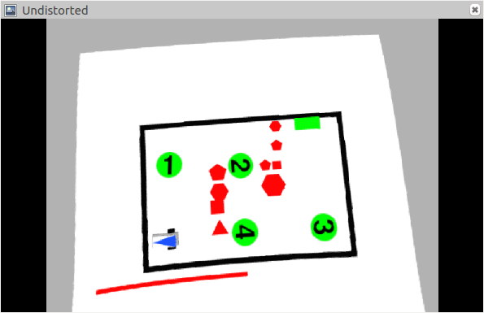

## Extrinsic Calibration

Now after the intrinsic calibration, we did the extrinsic calibration to determine the Rotational and translational matrix. Four points will be chosen in the image plane and then these 4 points will be solved using the solvePnP interface from opencv to solve the extrinsic problem. 
```
Implemented Function:   extrinsicCalib
Functionality:  To find the rotational and translational vector
Function Available in:  src/student_interface.cpp
Reference for implementation:  professor_interface.cpp and opencv library
Directly Copied functions: mouseCallback() and pickNPoints()
```

## Perspective Projection and Unwarping

Now to have a bird's eye view of the image, where we need to project the 3D objects in a image plane, we carried out Perspective Projection and Unwarping of image. This is again carried out the opencv interfaces. First, findPlaneTransform() has to caarried through which we get a perspective projection matrix, through which we can unwarp the image

```
Implemented Function:   findPlaneTransform() and unwarp()
Functionality:  To get a unwarped image
Function Available in:  src/student_interface.cpp
Reference for implementation:  professor_interface.cpp and opencv library
```
> Unwarp ground
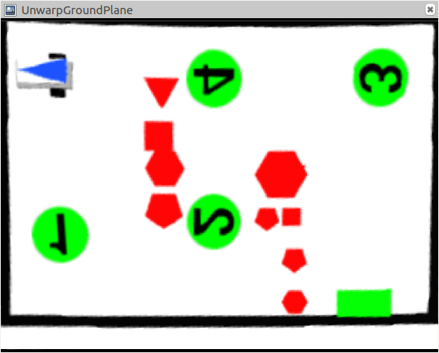

> Unwarp Robot
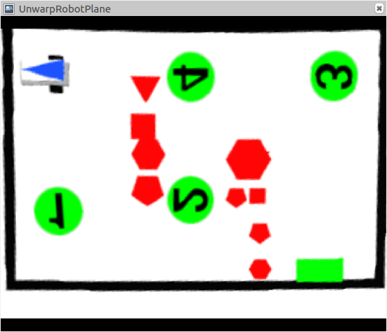

## Process Map
After calibration, we need to process map is an important function for further navigation steps. It is decided that obstacles will be Red color with different shapes, gate as green rectangle and victims as green circles. 

### Obstacles detection- Red shapes

```
Implemented Function:  processObstacles()
Functionality: To get all obstacles information
Function Available in:  src/student_interface.cpp
Reference for implementation:  professor_interface.cpp, demo code and opencv library
```

> Obstacle detection Output
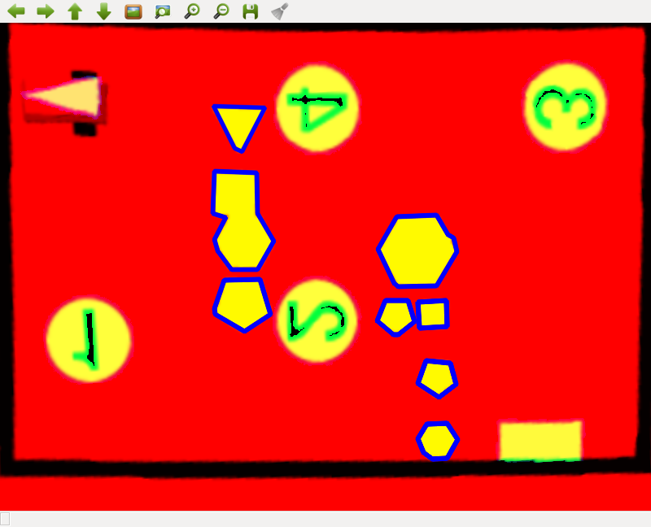

### Gate detection- Green Rectangle

``` 
Implemented Function:  processGate()
Functionality:  To get all gate/Destination information
Function Available in:  src/student_interface.cpp
Reference for implementation:  professor_interface.cpp, demo code and opencv library
```
> Gate detection Output
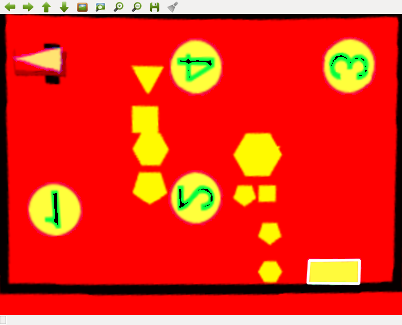

### Victim Detection - Green Circles

```
Implemented Function:  processVictims()
Functionality: To get all victims location
Function Available in:  src/student_interface.cpp
Reference for implementation:  professor_interface.cpp, demo code and opencv library
```

> Victims detection Output
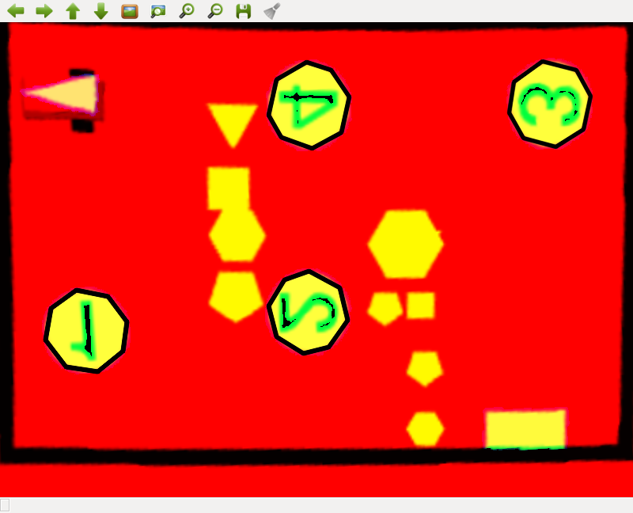

## Find Robot:
we directly utilized the function provided by the teaching assistant as we found that implementation was already in the best shape.

```
Implemented Function:   findRobot()
Functionality:  To get the robot location
Function Available in:  src/student_interface.cpp
```

> Robot detection  Output
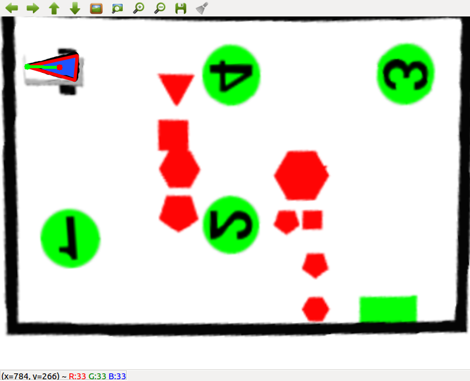

## Victim Center: 
We created a list of victims (contains different size of a polygon to use) (of color green) for robot to find that can be made available inside the arena .

## Obstacle World: 
Obstacle world consists a list of different type of polygons distinguished on the basis of their radius and center. 

## Plan Path:
In Plan Path function, we have implemented our own RRT* algorithm, which can be found inside src/student_interface.cpp. In our algorithm we used the already implemented victims list and obstacles' list. Using dubins planner (which consists the initialized value for the algorithm) and clipper library for inflating the polygons. In Dubins local planner, the curvature values are classified as either +MAX or -MIN. 

### Planning Algorithm: 
Inside Plan Path finction, once Obstacle World list is declared, which mission to  choose is decided by the user. A non-discretized path named as raw path is initiated. RRT planning is called with all the pre-initialized values for theta, path, raw path, kmax, node points, obstacle list, obstacles' radii, obstacles' center, length of the path and information about the gate. 
   Then Costmap Matrix is initialized. Costmap connnections are calculated. The first and second loop to compute costs in pair-wise combination is initiated. Consecutive node points are received. Planning algorithm is called again. Time cost is calculated and added to the costmap. Time bonus is added unless Goal column is received. Paths are then cleared for the next computation. First and second loop end here.
Once boths loops are computed, print and write the costmap. Using Djisktra method, we found the best cost path and major points are added to the raw path. The RRT planning is computed. 

### RRT (Secondary Function)   
RRT is created as a secondary function is created with initializing all the same variables as before. List of all the possible nodes is created. List of all the possible current paths is created. First node in the tree is added. a temporary path is created from a point to point. The first goal is initiated as the first number. Best goal cost is defined for the future purposes. Robot position (with x, y and theta) is initialized. It is presumed if the goal is not 1 then the last position will be the path. 

First line of the RRT is created which consists of the nodes and paths lists. Line 2 of RRT is to reach the each major point in the raw path. Nodes are reset if the next major point is not found for too long. The lists are cleared and only first element is kept. Then loops are counted. 

Using the if condition it is decided to go further either with RRT or RRT*. After deciding, we enter the loop to create 3rd and 4th lines of RRT, which are to compute next random points. Line 5 of the RRT is initiated to find the closest node or the parent node. Line 4 will also check either if the distance is very small or the goal is reached. RRT line 6 is to compute the angle. For computing angle, lines are created between point x and point y from the given point. Condition is checked if RRT is going to the next goal or the last goal. Another condition is checked if the robot is arriving at goal, it should move orthogonally. 

New path is defined and dubins curve local and global planned are used. Dubins curve planner will try to find a path fromt the initial point to the goal. RRT line 7 will compute the collision check which will include either robot collision with obstacles (which are inflated for this purpose) or with the arena border. If there is collsion, robot will try to make a curve around the obstacle or the arena border and find the new path. 

After RRT ends, loop for RRT star is intiated. It will start again from the line 3. After both loops are concluded and points are added to the final path. Djikstra algorithm is used to solve the best cost to goal. After computing the algorithm, results are printed. 

Sort pair function is created to sort the victim list by 1st element of the pair. Compute angle function is used to find the angle between the defined two points. 

### Dubins Local planner
This local planner is impleementied by solving the dubins curve problem.
```
Implentation function: test_dubins()
file: test_dubins.cpp

```
 
## Plan Path results

### Mission 1 results

> High level RRT* planner path points 

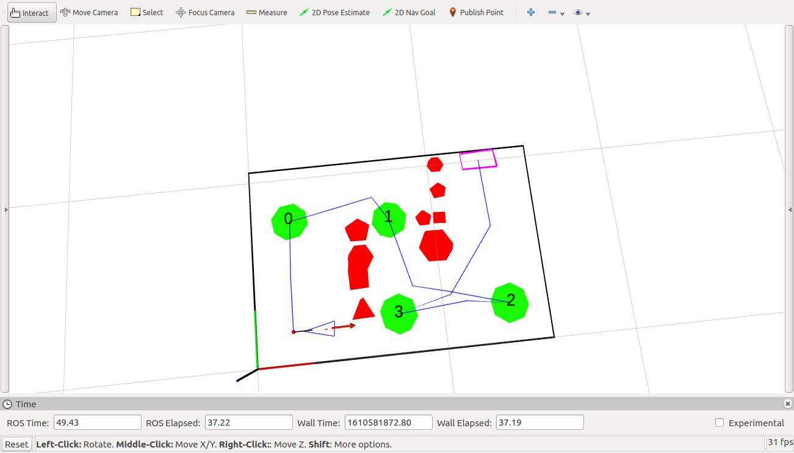

> Local planner path points

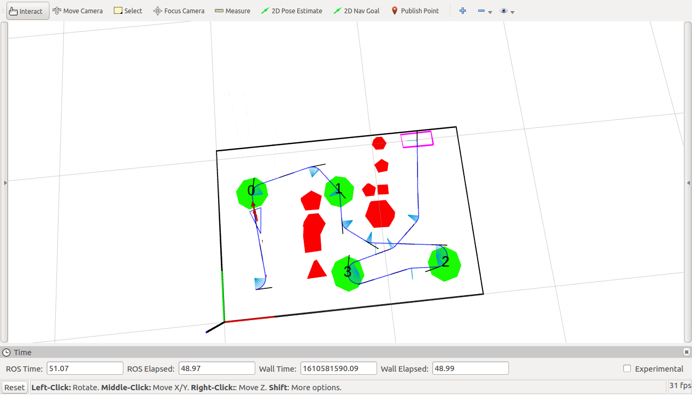


### Mission 2 results

> High level RRT* planner path points 

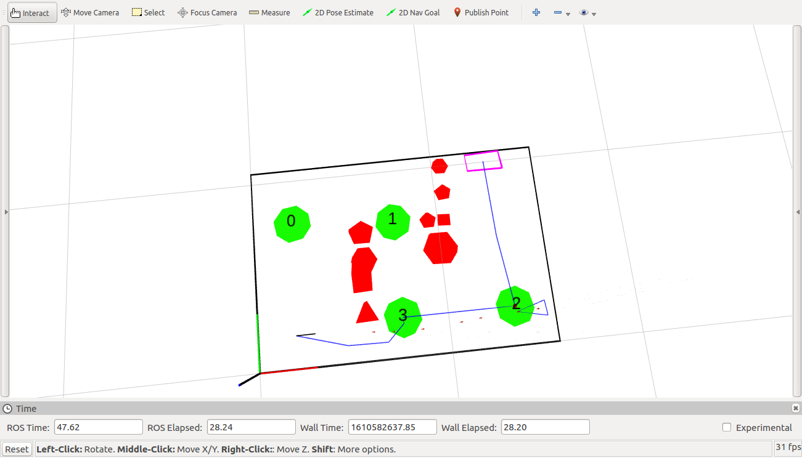

> Local planner path points

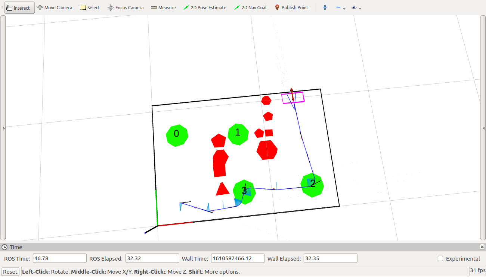

 


